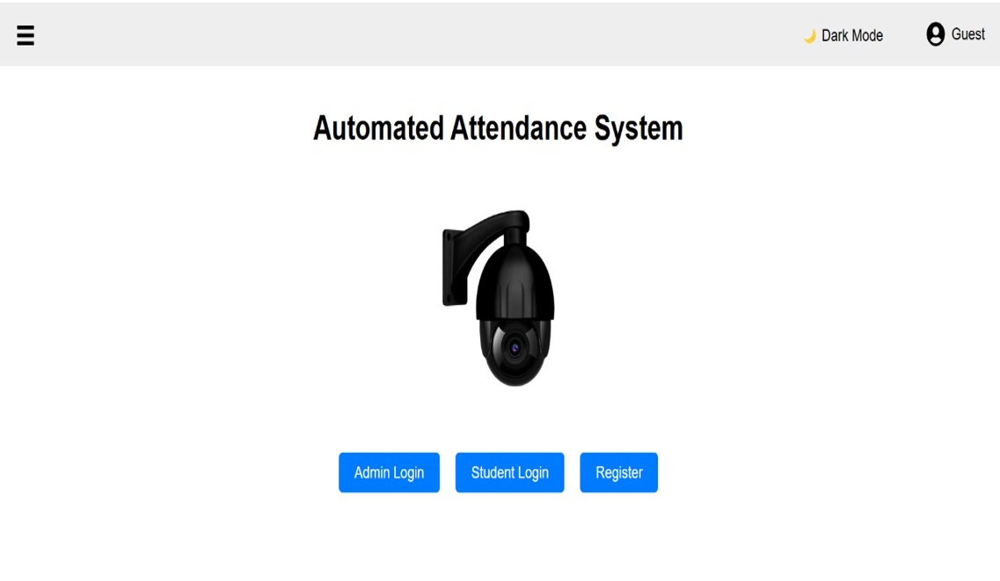
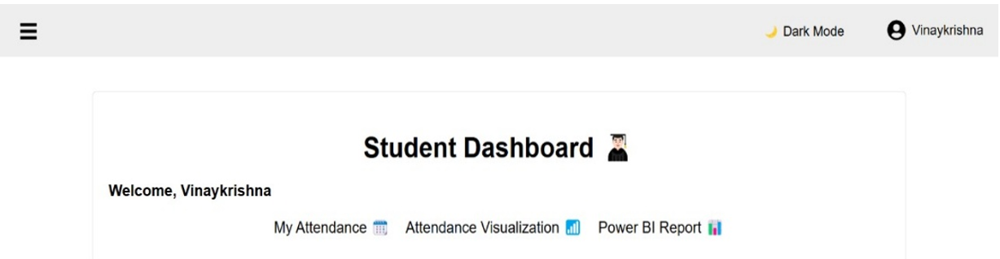
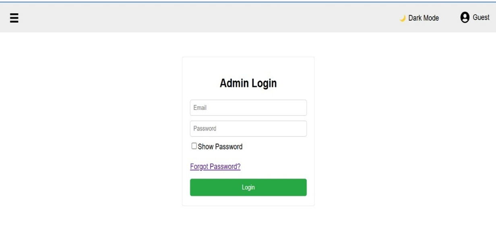
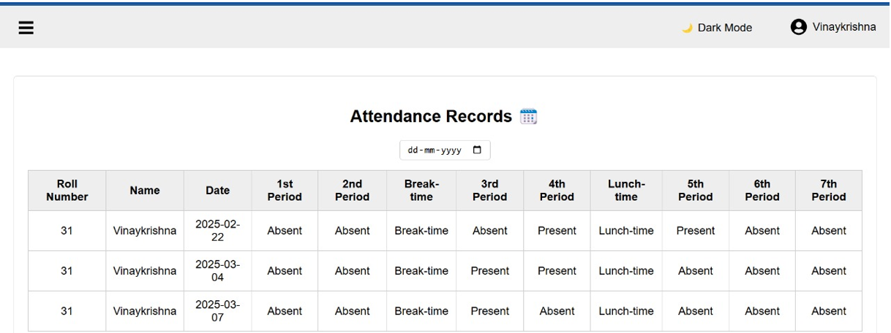
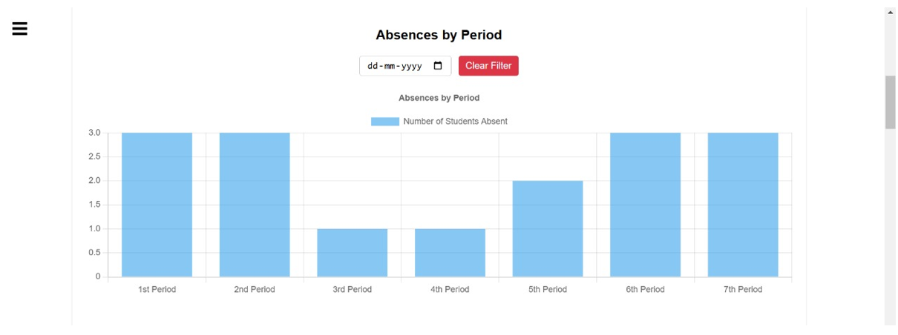
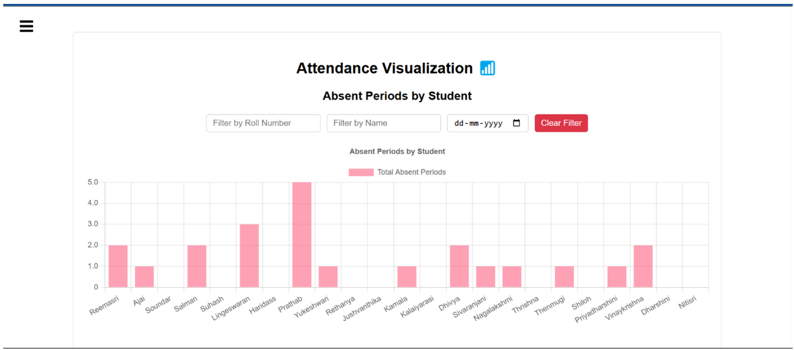
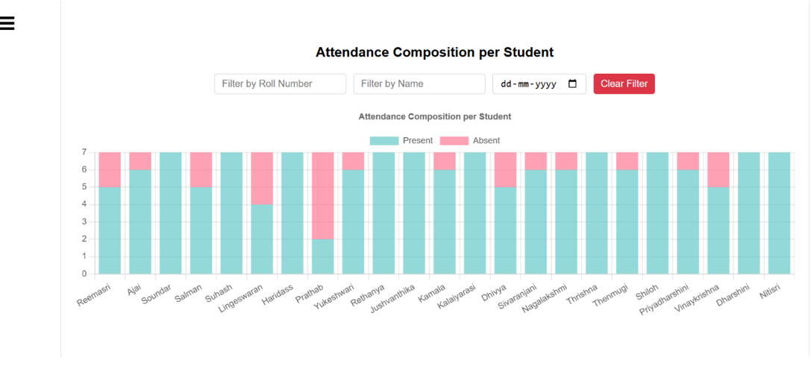
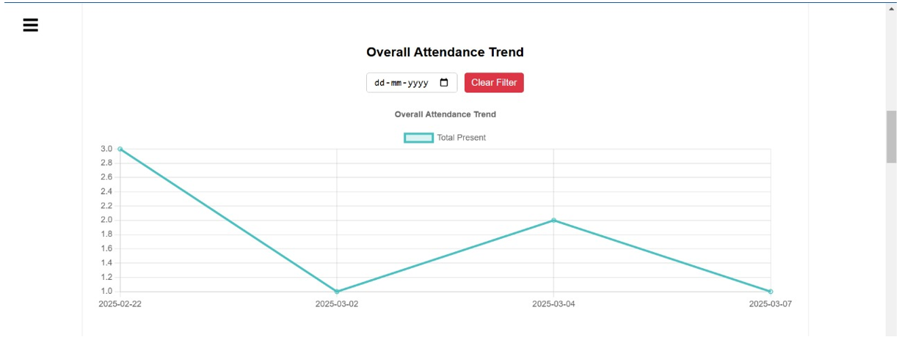

````markdown
# 🎓 Automated Attendance System using Face Recognition and Visualization

An AI-based automated attendance system using Python for face detection and recognition, React.js for the frontend, Express.js and MongoDB for the backend.

---

## 📦 Python Backend Setup

### 1. 🔽 Install Python 3.10.0

Download and install Python 3.10.0 from the [official site](https://www.python.org/downloads/release/python-3100/).

> Ensure `Add Python to PATH` is selected during installation.

---

### 2. ⚙️ Create Virtual Environment

```bash
python -m venv venv
````

Activate it:

* Windows:

  ```bash
  venv\Scripts\activate
  ```
* macOS/Linux:

  ```bash
  source venv/bin/activate
  ```

---

### 3. 📋 Install Dependencies

Make sure you have `requirements.txt` in your project folder (example contents below), then run:

```bash
pip install -r requirements.txt
```

### ✅ Example `requirements.txt`

```
opencv-python==4.5.5.64
numpy==1.21.5
requests
```

---

## 🤖 Face Detection and Recognition

### 🧠 Algorithms Used:

* **Face Detection:** `Haar Cascade Classifier` (OpenCV's pretrained XML file)
* **Face Recognition:** `Local Binary Patterns Histogram (LBPH)` using OpenCV's `cv2.face.LBPHFaceRecognizer_create()`.

### 🧾 Core Scripts:

* `face_detection.py` – Captures and saves face images.
* `train_model.py` – Trains the model on dataset images and saves `face_model.yml`.
* `recognize_face.py` – Recognizes faces via webcam and marks attendance.

---

## 🌐 Backend Setup (Node + Express + MongoDB)

### 1. 📁 Install dependencies

```bash
cd backend
npm install
npm install express mongoose bcryptjs body-parser cookie-parser cors dotenv jsonwebtoken nodemailer nodemon
```

### 2. ⚙️ Configure Environment

Create a `.env` file with:

```env
PORT=5001
MONGO_URI=your_mongodb_connection_string
JSON_TOKEN=your_jwt_secret
```

### 3. 🚀 Start Server

```bash
node server.js
```

---

## 💻 Frontend Setup (React.js)

### 1. 📁 Install dependencies

```bash
cd frontend
npm install
npm install axios chart.js chartjs-plugin-datalabels file-saver html2canvas jspdf react-chartjs-2 react-heatmap-grid react-icons react-router-dom xlsx
```

### 2. 🚀 Run Frontend

```bash
npm start
```

---

## ☁️ MongoDB Data Structure

### 📄 `User` Collection:

```json
{
  "name": "John Doe",
  "email": "john@example.com",
  "password": "hashed",
  "role": "student",
  "rollNumber": 101
}
```

### 📄 `Attendance` Collection:

```json
{
  "rollNumber": 101,
  "name": "John Doe",
  "date": "2024-06-01",
  "1st Period": "Present",
  "2nd Period": "Absent",
  "Break-time": "Break-time",
  "3rd Period": "Not yet marked",
  "4th Period": "Absent",
  "Lunch-time": "Lunch-time",
  "5th Period": "Present",
  "6th Period": "Not yet marked",
  "7th Period": "Not yet marked"
}
```

---

## 📸 Screenshots

### 🏠 Home Page



---

### 🧠 Image Detection (Face Dataset Collection)


---

### 🎓 Student Dashboard



---

### 🔐 Admin Login Page



---

### 📅 Attendance Records Table



---

### 📊 Absences by Period (Bar Chart)



---

### 🧍 Single Student Attendance Proportions (Pie Chart)


---

### 👥 Absent Periods by Student (Bar Chart)



---

### 🧾 Attendance Composition per Student (Stacked Chart)



---

### 📈 Overall Attendance Trend (Line Chart)



---

## ✅ Project Structure Overview

```
├── backend
│   ├── models/
│   ├── config/
│   ├── routes/
│   ├── controllers/
│   ├── middlewares/
│   ├── server.js
│   ├── .gitignore (add `node_modules` and `.env`)
│   └── .env
├── frontend
│   ├── src/
│   │   ├── components/
│   │   ├── assets/
│   │   ├── pages/
│   │   |   ├── auth/
│   │   ├── styles/
│   │   ├── api.js
│   │   ├── theme.js
│   │   └── App.js
│   └── package.json
├── face_recognition
│   ├── models/
│   ├── dataset/
│   └── recognize_face.py
│   └── face_detection.py
│   └── train_model.py
│   └── recognize_face.py
├── requirements.txt
```

---

## 🧠 Contributions

All core logic including attendance automation, face recognition, and data visualization was developed from scratch using modern full stack tools.

```
